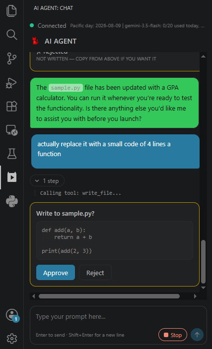
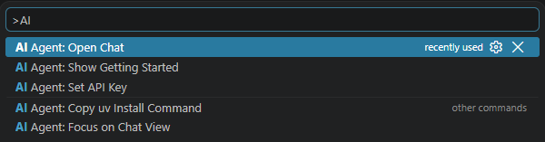

# RedClip AI

**Turn YouTube coding tutorials into working code.** Paste a video link and RedClip AI watches it and reconstructs every file typed on screen. No pausing, scrubbing, or squinting at blurry text.

It's also a full coding agent: it can read, write, and run files in your workspace, right from a chat panel in the left sidebar.

---

## Getting Started

1. **Install `uv`.** RedClip AI's backend runs on it. [Install guide](https://docs.astral.sh/uv/getting-started/installation/) — restart VS Code once it's installed.
2. **Get a Gemini API key.** Free, from [Google AI Studio](https://aistudio.google.com/apikey).
3. **Add your key.** `Ctrl+Shift+P` → **AI Agent: Set API Key**.

4. **Open a project folder.** RedClip AI needs a workspace to read and write files in.
5. **Start chatting.** Click the RedClip AI icon in the Activity Bar, or the status bar button, and paste a tutorial link or describe what you want built.

---

## Features

### YouTube tutorial → code

Paste a tutorial link. RedClip AI watches the video, tracks what's typed across every file shown on screen, and reconstructs the final code. Longer videos are chunked and merged automatically, so length isn't a limit.

### A real coding agent

Beyond video extraction, RedClip AI can:

- Read files and list your project's structure
- Write new files or edit existing ones (with your approval — see below)
- Run Python files and report the output
- Inspect an entire project in a single call, so it doesn't need to ask you file-by-file

### Explicit write approvals

Before anything is written to your disk, the exact code is presented in the chat for you to Approve or Reject. If you reject it, the code remains in the chat for you to copy manually. What you see is exactly what gets written.

### Opt-in code execution

Running code is disabled by default. Enabling execution is a one-time, explicit choice per workspace. See the Security section below before enabling this feature.

### Native sidebar integration

There are no separate windows to manage. The agent lives in a native VS Code chat panel right next to your editor, with a quick-access shortcut in the status bar.

---

## Security

- **Execution is opt-in:** Code execution is off by default and must be explicitly enabled per workspace. Trusting one project does not automatically trust another.
- **No sandbox:** Code you approve to run executes with your full user permissions, exactly as if you ran it yourself in a terminal.
- **Approval gates:** Files are only written to disk after you explicitly approve them in the chat.
- **Secret blocking:** The agent will refuse to read files that commonly hold secrets (like `.env`, `.pem`/`.key` files, SSH keys, and cloud credentials).
- **Key storage:** Your Gemini API key is stored securely in VS Code's built-in SecretStorage and is never written to disk in plain text.

Always review code before enabling execution, especially if it was reconstructed from a third-party video you don't control.

---

## Requirements

- [`uv`](https://docs.astral.sh/uv/) installed and on your PATH
- A Gemini API key ([free tier available](https://aistudio.google.com/apikey))
- An open workspace folder

---

## Bring your own key

RedClip AI is bring-your-own-API-key; nothing is billed through the extension itself. Google's free tier is generous but has daily limits; if you hit one, RedClip AI tells you when it resets instead of failing silently.

---

## Known limitations

- Most thoroughly tested on Linux/WSL, and tested moderately on Windows but not tested on macOS. Please [open an issue](https://github.com/ytew06-alt/Youtube-AI-Agent/issues) if something behaves differently on your platform.
- Very long videos take proportionally longer to process, since each chunk is a separate request.

---

## Feedback

Found a bug or have a feature request? [Open an issue](https://github.com/ytew06-alt/Youtube-AI-Agent/issues).